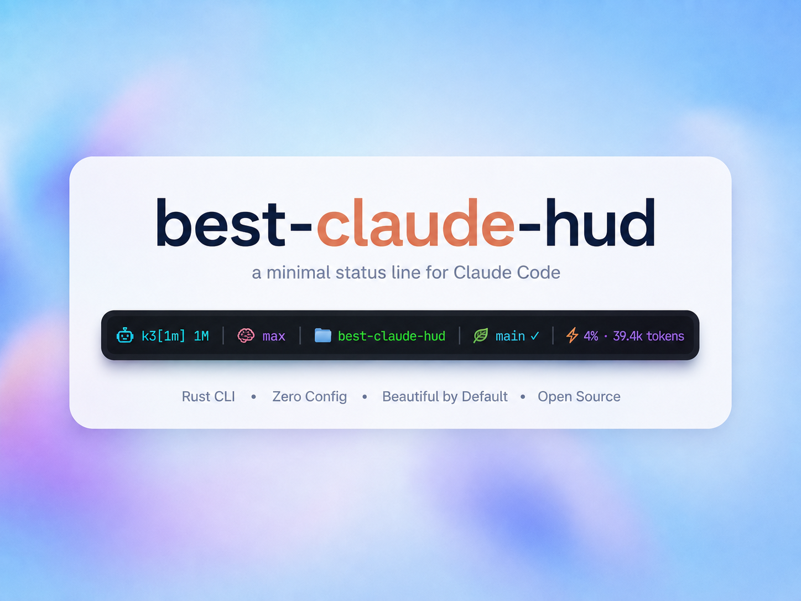
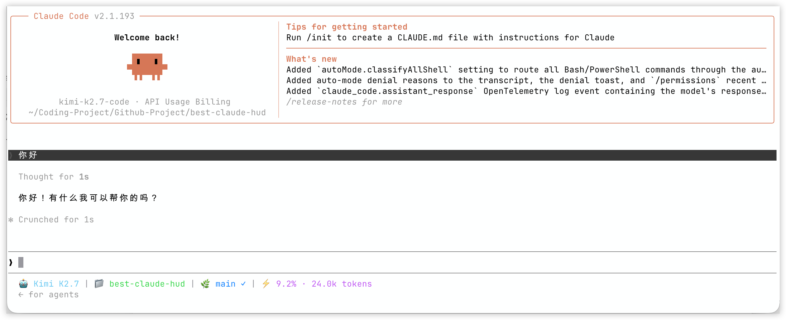

<h4 align="right"><strong><a href="./README.md">English</a></strong> | <a href="./README_CN.md">简体中文</a></h4>

<p align="center">
  <a href="https://github.com/GaoSSR/best-claude-hud">
    
  </a>
</p>

<h3 align="center"><nobr>Minimal Claude Code statusline HUD, powered by Rust</nobr></h3>

---

<p align="center">
  
  
  
  
</p>

## best-claude-hud Overview

`best-claude-hud` is a high-performance Claude Code statusline tool written in Rust. It shows the status information you actually need while using Claude Code in a terminal: model, workspace, Git branch/status, context window usage, and optional usage/rate-limit metadata.

This project starts from the source code of [`Haleclipse/CCometixLine`](https://github.com/Haleclipse/CCometixLine), then rebuilds the project under a new repository, package name, release workflow, and maintenance direction. The default goal is a compact single-line HUD, not a noisy multi-line dashboard.

<p align="center">
  
</p>

The default statusline focuses on:

- Claude model display
- current workspace directory
- Git branch, clean/dirty/conflict state, and ahead/behind counts
- context window token usage from the active Claude Code transcript
- optional usage/rate-limit, cost, session, and output style segments

## Why This Fork Exists

The original `CCometixLine` is useful and feature-rich, but the maintenance queue has open PRs/issues that need review, compatibility fixes, and a clear default-output policy. `best-claude-hud` keeps the useful Rust/TUI foundation and makes the project easier to maintain as a public package.

Accepted in the initial rebuild:

- npm-first installation and platform optional dependencies
- no binary copy/link into `~/.claude`
- Claude Code `model` input compatible with both string and object forms
- `rate_limits` parsed directly from Claude Code statusLine stdin before falling back to API polling
- context-window parsing fixed so a new terminal/session does not reuse stale token data from an older transcript
- `git --no-optional-locks` used for statusline Git commands

## Install

`best-claude-hud` is distributed through npm. The npm package uses prebuilt native binaries; users do not need Rust installed.

```bash
npm install -g @gaossr/best-claude-hud
```

Using yarn or pnpm:

```bash
yarn global add @gaossr/best-claude-hud
pnpm add -g @gaossr/best-claude-hud
```

For users in China:

```bash
npm install -g @gaossr/best-claude-hud --registry https://registry.npmmirror.com
```

Update an existing installation:

```bash
npm update -g @gaossr/best-claude-hud
```

Uninstall:

```bash
npm uninstall -g @gaossr/best-claude-hud
```

## Claude Code Configuration

Add this to your Claude Code `~/.claude/settings.json`:

```json
{
  "statusLine": {
    "type": "command",
    "command": "best-claude-hud",
    "padding": 0
  }
}
```

The npm package intentionally does not install a binary into `~/.claude`. It uses the global npm command and resolves the matching native binary from Kiri-style npm alias optional dependencies.

## Commands

```bash
best-claude-hud                    # open the interactive menu when run in a terminal
best-claude-hud --help             # print command help
best-claude-hud --version          # print version
best-claude-hud --config           # open the TUI configuration interface
best-claude-hud --theme minimal    # temporarily render with a built-in theme
best-claude-hud --patch <cli.js>   # patch Claude Code cli.js context warnings
```

## Themes

Temporarily override the configured theme:

```bash
best-claude-hud --theme cometix
best-claude-hud --theme minimal
best-claude-hud --theme gruvbox
best-claude-hud --theme nord
best-claude-hud --theme powerline-dark
best-claude-hud --theme powerline-light
best-claude-hud --theme powerline-rose-pine
best-claude-hud --theme powerline-tokyo-night
```

Custom themes can be stored under:

```text
~/.claude/best-claude-hud/themes/
```

Then use:

```bash
best-claude-hud --theme my-custom-theme
```

## Configuration

Configuration files are stored under:

```text
~/.claude/best-claude-hud/
```

Important files:

- `config.toml`: main HUD and segment configuration
- `models.toml`: model display names and context window limits
- `themes/*.toml`: custom theme presets
- `.api_usage_cache.json`: optional usage API cache
- `.update_state.json`: update-check state

Run the TUI configurator:

```bash
best-claude-hud --config
```

Available segment families:

- `model`
- `directory`
- `git`
- `context_window`
- `usage`
- `cost`
- `session`
- `output_style`
- `update`

## Model Configuration

`models.toml` is created automatically on first run:

```text
~/.claude/best-claude-hud/models.toml
```

It controls model display names and context limits. Claude model families are recognized automatically, while third-party models can be customized:

```toml
[[models]]
pattern = "kimi-k2.7"
display_name = "Kimi K2.7"
context_limit = 262144

[[models]]
pattern = "glm-5"
display_name = "GLM-5"
context_limit = 200000

[[models]]
pattern = "qwen3-coder"
display_name = "Qwen Coder"
context_limit = 256000

[[context_modifiers]]
pattern = "[1m]"
display_suffix = " 1M"
context_limit = 1000000
```

## Statusline Data

Claude Code sends statusLine data to the command through stdin. `best-claude-hud` reads:

- `model`
- `workspace.current_dir`
- `transcript_path`
- `cost`
- `output_style`
- `rate_limits`

For context window usage, the HUD reads only the active transcript file. If a new terminal/session has no transcript yet, it shows `0% · 0 tokens` instead of scanning older project history. This fixes the stale-token behavior where a new terminal inherited context usage from a previous Claude Code session.

## Git Status Indicators

- `✓`: clean working tree
- `●`: dirty working tree
- `⚠`: conflicts
- `↑n`: commits ahead of upstream
- `↓n`: commits behind upstream

Git commands run with `--no-optional-locks`, so the HUD does not create unnecessary `.git/index.lock` contention while you work.

## Claude Code Patch Utility

The inherited patcher can patch Claude Code `cli.js` to reduce context warning noise:

```bash
best-claude-hud --patch /path/to/claude-code/cli.js
```

Example:

```bash
best-claude-hud --patch ~/.local/share/fnm/node-versions/v24.4.1/installation/lib/node_modules/@anthropic-ai/claude-code/cli.js
```

The patcher creates a backup next to the target file before writing.

## Platform Support

| Platform | Native binary source | Status |
| --- | --- | --- |
| MacOS arm64 | `@gaossr/best-claude-hud@<version>-darwin-arm64` via npm alias | Supported |
| MacOS x64 | `@gaossr/best-claude-hud@<version>-darwin-x64` via npm alias | Supported |
| Linux x64 musl | `@gaossr/best-claude-hud@<version>-linux-x64` via npm alias | Supported |
| Windows x64 | `@gaossr/best-claude-hud@<version>-win32-x64` via npm alias | Supported |
| Linux arm64 / Windows arm64 | - | Planned |

## Requirements

- Claude Code with `statusLine` support
- Git for branch/status display
- A terminal with ANSI color support
- A Nerd Font if you choose Nerd Font or Powerline themes

## Development

For maintainers and contributors working from source:

```bash
cargo fmt
cargo clippy -- -D warnings
cargo test
cargo build --release
cargo run -- --help
npm --prefix packaging/npm run check
npm --prefix packaging/npm run test
```

Useful release checks:

```bash
cargo build --release
mkdir -p release-artifacts
tar -C target/release -czf release-artifacts/best-claude-hud-darwin-arm64.tar.gz best-claude-hud
node packaging/npm/scripts/build-packages.js \
  --version 0.1.2 \
  --release-dir release-artifacts \
  --output-dir npm-tarballs
```

## Release

Release is split into two workflows:

- `Release`: builds GitHub release artifacts and npm tarballs
- `npm publish`: manually publishes npm packages after release artifacts exist

Create a GitHub Release:

```bash
git tag v0.1.2
git push origin v0.1.2
```

Publish to npm after npm trusted publishing is configured:

```bash
gh workflow run "npm publish" --repo GaoSSR/best-claude-hud -f version=0.1.2
```

## Project Resources

- [Changelog](./CHANGELOG.md)
- [Contributing guide](./CONTRIBUTING.md)
- [Security policy](./SECURITY.md)
- [Upstream triage](./docs/triage.md)

## Acknowledgements

`best-claude-hud` is based on source code from [`Haleclipse/CCometixLine`](https://github.com/Haleclipse/CCometixLine). The upstream project is declared MIT in its Cargo metadata, and upstream attribution is preserved in [NOTICE](./NOTICE).

## License

Licensed under the [Apache License 2.0](./LICENSE).
