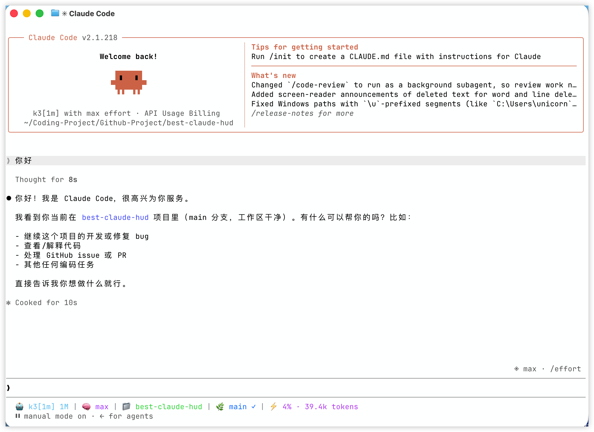

<h4 align="right"><strong><a href="./README.md">English</a></strong> | <a href="./README_CN.md">简体中文</a></h4>

<p align="center">
  <a href="https://github.com/GaoSSR/best-claude-hud">
    
  </a>
</p>

<h3 align="center"><nobr>Minimal Claude Code statusline HUD, powered by Rust</nobr></h3>

---

<p align="center">
  
  
  
  
</p>

## best-claude-hud Overview

`best-claude-hud` is a high-performance Claude Code statusline tool written in Rust. It shows the status information you actually need while using Claude Code in a terminal: model, workspace, Git branch/status, context window usage, and optional usage/rate-limit metadata.

<p align="center">
  
</p>

The default statusline focuses on:

- Claude model display
- Claude Code launch directory, stable across temporary working-directory changes
- Git branch, clean/dirty/conflict state, and ahead/behind counts
- context window usage from Claude Code's official statusLine data, with active-transcript fallback
- optional usage/rate-limit, cost, session, and output style segments

## Install

`best-claude-hud` is distributed through npm. The npm package uses prebuilt native binaries; users do not need Rust installed.

Install and configure Claude Code in one line:

```bash
npm install -g best-claude-hud && best-claude-hud --setup
```

Restart Claude Code after setup. Existing sessions do not automatically reload `~/.claude/settings.json`.

Install only:

```bash
npm install -g best-claude-hud
```

Using yarn or pnpm:

```bash
yarn global add best-claude-hud
pnpm add -g best-claude-hud
```

For users in China:

```bash
npm install -g best-claude-hud --registry https://registry.npmmirror.com && best-claude-hud --setup
```

Update an existing installation:

```bash
npm update -g best-claude-hud
```

Uninstall:

```bash
npm uninstall -g best-claude-hud
```

## Nix

`best-claude-hud` also ships a Nix flake for declarative and reproducible environments.

Run without installing globally:

```bash
nix run github:GaoSSR/best-claude-hud -- --help
```

Install into a Nix profile:

```bash
nix profile install github:GaoSSR/best-claude-hud
best-claude-hud --setup
```

For home-manager or another declarative setup, point Claude Code directly at the Nix store binary:

```nix
# In your flake inputs:
# best-claude-hud.url = "github:GaoSSR/best-claude-hud";

{ inputs, pkgs, ... }:

let
  hud = inputs.best-claude-hud.packages.${pkgs.system}.default;
in
{
  home.packages = [ hud ];

  home.file.".claude/settings.json".text = builtins.toJSON {
    statusLine = {
      type = "command";
      command = "${hud}/bin/best-claude-hud";
      padding = 0;
    };
  };
}
```

If you already manage `~/.claude/settings.json` with Nix, merge the `statusLine` block into your existing JSON instead of replacing the whole file.

Development shell:

```bash
nix develop
```

## Claude Code Configuration

`npm install -g best-claude-hud` only installs the command. Claude Code will not show the HUD until `statusLine` is configured.

Recommended:

```bash
best-claude-hud --setup
```

The setup command writes a `statusLine` block to `~/.claude/settings.json` and preserves existing settings. It resolves the installed command to an absolute path when possible:

```json
{
  "statusLine": {
    "type": "command",
    "command": "/path/to/best-claude-hud",
    "padding": 0
  }
}
```

Manual configuration can also use `"command": "best-claude-hud"` if your Claude Code sessions inherit the same PATH as your shell. If `statusLine` already exists, `--setup` creates a timestamped backup next to `settings.json` before replacing it. Restart Claude Code after changing this file.

The npm package intentionally does not install a binary into `~/.claude`. It uses the global npm command and resolves the matching native binary from Kiri-style npm alias optional dependencies.

## Commands

```bash
best-claude-hud                    # open the interactive menu when run in a terminal
best-claude-hud --help             # print command help
best-claude-hud --version          # print version
best-claude-hud --setup            # configure Claude Code statusLine
best-claude-hud --config           # open the TUI configuration interface
best-claude-hud --theme minimal    # temporarily render with a built-in theme
best-claude-hud --patch <cli.js>   # patch Claude Code cli.js context warnings
```

## Themes

Temporarily override the configured theme:

```bash
best-claude-hud --theme cometix
best-claude-hud --theme minimal
best-claude-hud --theme gruvbox
best-claude-hud --theme nord
best-claude-hud --theme powerline-dark
best-claude-hud --theme powerline-light
best-claude-hud --theme powerline-rose-pine
best-claude-hud --theme powerline-tokyo-night
```

Custom themes can be stored under:

```text
~/.claude/best-claude-hud/themes/
```

Then use:

```bash
best-claude-hud --theme my-custom-theme
```

## Configuration

Configuration files are stored under:

```text
~/.claude/best-claude-hud/
```

Important files:

- `config.toml`: main HUD and segment configuration
- `models.toml`: model display names and context window limits
- `themes/*.toml`: custom theme presets
- `.api_usage_cache.json`: optional usage API cache
- `.update_state.json`: update-check state

Run the TUI configurator:

```bash
best-claude-hud --config
```

Available segment families:

- `model`
- `directory`
- `git`
- `context_window`
- `usage`
- `cost`
- `session`
- `output_style`
- `update`

## Model Configuration

`models.toml` is created automatically on first run:

```text
~/.claude/best-claude-hud/models.toml
```

It controls model display names and context limits. Claude model families are recognized automatically, while third-party models can be customized:

```toml
[[models]]
pattern = "kimi-k2.7"
display_name = "Kimi K2.7"
context_limit = 262144

[[models]]
pattern = "glm-5"
display_name = "GLM-5"
context_limit = 200000

[[models]]
pattern = "qwen3-coder"
display_name = "Qwen Coder"
context_limit = 256000

[[context_modifiers]]
pattern = "[1m]"
display_suffix = " 1M"
context_limit = 1000000
```

## Statusline Data

Claude Code sends statusLine data to the command through stdin. `best-claude-hud` reads:

- `model`
- `workspace.project_dir` for the stable Claude Code launch directory
- `workspace.current_dir` as a fallback for older Claude Code versions
- `transcript_path`
- `context_window`
- `cost`
- `output_style`
- `rate_limits`

For context window usage, the HUD prefers Claude Code's official `context_window` fields. The active transcript is used only as a compatibility fallback when those fields are absent, null, or temporarily zero. All-zero usage placeholders written after an interrupted response are ignored, so pressing `Esc` does not erase the last valid context reading. A genuinely new session with no usage still shows `0% · 0 tokens` and never scans older project history.

## Git Status Indicators

- `✓`: clean working tree
- `●`: dirty working tree
- `⚠`: conflicts
- `↑n`: commits ahead of upstream
- `↓n`: commits behind upstream

Git commands run with `--no-optional-locks`, so the HUD does not create unnecessary `.git/index.lock` contention while you work.

## Claude Code Patch Utility

The inherited patcher can patch Claude Code `cli.js` to reduce context warning noise:

```bash
best-claude-hud --patch /path/to/claude-code/cli.js
```

Example:

```bash
best-claude-hud --patch ~/.local/share/fnm/node-versions/v24.4.1/installation/lib/node_modules/@anthropic-ai/claude-code/cli.js
```

The patcher creates a backup next to the target file before writing.

## Platform Support

| Platform | Native binary source | Status |
| --- | --- | --- |
| MacOS arm64 | Native binary selected automatically by npm | Supported |
| MacOS x64 | Native binary selected automatically by npm | Supported |
| Linux x64 musl | Native binary selected automatically by npm | Supported |
| Windows x64 | Native binary selected automatically by npm | Supported |
| Linux arm64 / Windows arm64 | - | Planned |

## Requirements

- Claude Code with `statusLine` support
- Git for branch/status display
- A terminal with ANSI color support
- A Nerd Font if you choose Nerd Font or Powerline themes

## Development

For maintainers and contributors working from source:

```bash
cargo fmt
cargo clippy -- -D warnings
cargo test
cargo build --release
cargo run -- --help
npm --prefix packaging/npm run check
npm --prefix packaging/npm run test
```

Useful release checks:

```bash
cargo build --release
mkdir -p release-artifacts
tar -C target/release -czf release-artifacts/best-claude-hud-darwin-arm64.tar.gz best-claude-hud
node packaging/npm/scripts/build-packages.js \
  --version 0.1.7 \
  --release-dir release-artifacts \
  --output-dir npm-tarballs
```

## Release

Release is split into two workflows:

- `Release`: builds GitHub release artifacts and npm tarballs
- `npm publish`: manually publishes npm packages after release artifacts exist

Create a GitHub Release:

```bash
git tag v0.1.7
git push origin v0.1.7
```

Publish to npm after npm trusted publishing is configured:

```bash
gh workflow run "npm publish" --repo GaoSSR/best-claude-hud -f version=0.1.7
```

## Project Resources

- [Changelog](./CHANGELOG.md)
- [Contributing guide](./CONTRIBUTING.md)
- [Security policy](./SECURITY.md)
- [Upstream triage](./docs/triage.md)

## Acknowledgements

Third-party attribution is preserved in [NOTICE](./NOTICE).

## License

Licensed under the [Apache License 2.0](./LICENSE).
