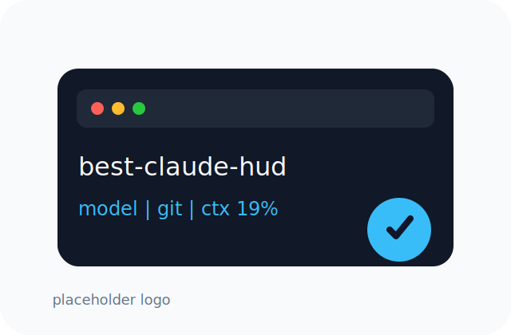

<h4 align="right"><a href="./README.md">English</a> | <strong><a href="./README_CN.md">简体中文</a></strong></h4>

<p>
  <picture>
    <source media="(prefers-color-scheme: dark)" srcset="assets/best-claude-hud-logo-placeholder.svg">
    <source media="(prefers-color-scheme: light)" srcset="assets/best-claude-hud-logo-placeholder.svg">
    
  </picture>
</p>

<br />
<br />

<p align="center">
  <a href="https://github.com/GaoSSR/best-claude-hud">
    <picture>
      <source media="(prefers-color-scheme: dark)" srcset="assets/best-claude-hud-wordmark-dark.svg">
      <source media="(prefers-color-scheme: light)" srcset="assets/best-claude-hud-wordmark-light.svg">
      
    </picture>
  </a>
</p>

<br clear="right" />

<h3 align="center"><nobr>极简 Claude Code 状态栏 HUD，由 Rust 驱动</nobr></h3>

---

<p align="center">
  
  
  
  
</p>

## best-claude-hud 概览

`best-claude-hud` 是一个用 Rust 写的高性能 Claude Code 状态栏工具。它在终端中展示真正有用的 Claude Code 工作状态：当前模型、工作目录、Git 分支/状态、上下文窗口占用，以及可选的 usage/rate limit 信息。

本项目基于 [`Haleclipse/CCometixLine`](https://github.com/Haleclipse/CCometixLine) 的源代码重建，但使用新的仓库、包名、发布流程和维护策略。默认目标是紧凑的单行 HUD，而不是高密度、多行、污染屏幕的信息面板。

<p align="center">
  
</p>

默认状态栏关注：

- Claude 模型显示
- 当前工作目录
- Git 分支、clean/dirty/conflict 状态和 ahead/behind 计数
- 当前 Claude Code transcript 的 context window token 占用
- 可选的 usage/rate-limit、cost、session、output style 段落

## 为什么要做这个 Fork

原项目 `CCometixLine` 很有价值，但积累了一些兼容性 PR/Issue，也缺少明确的默认输出策略。`best-claude-hud` 保留它有用的 Rust/TUI 基础，同时把项目整理成更适合维护和发布的公共开源项目。

初始重建已接收：

- npm-first 安装与多平台 optional dependencies
- npm 安装不再复制/硬链接二进制到 `~/.claude`
- Claude Code `model` 字段兼容 string/object 两种形式
- 优先从 Claude Code statusLine stdin 读取 `rate_limits`
- 修复 context window 解析，避免新终端/新会话复用旧 transcript token 数据
- Git 状态命令使用 `--no-optional-locks`

## 安装

`best-claude-hud` 通过 npm 分发。npm 包使用预构建原生二进制，用户不需要本地安装 Rust。

```bash
npm install -g best-claude-hud
```

使用 yarn 或 pnpm：

```bash
yarn global add best-claude-hud
pnpm add -g best-claude-hud
```

国内网络可使用 npm 镜像：

```bash
npm install -g best-claude-hud --registry https://registry.npmmirror.com
```

更新：

```bash
npm update -g best-claude-hud
```

卸载：

```bash
npm uninstall -g best-claude-hud
```

## Claude Code 配置

将下面内容加入 Claude Code 的 `~/.claude/settings.json`：

```json
{
  "statusLine": {
    "type": "command",
    "command": "best-claude-hud",
    "padding": 0
  }
}
```

npm 包不会把二进制安装到 `~/.claude`。它使用 npm 全局命令，并从 optional dependencies 中解析当前平台对应的原生二进制。

## 命令

```bash
best-claude-hud                    # 在终端中直接运行时打开交互式菜单
best-claude-hud --help             # 查看帮助
best-claude-hud --version          # 查看版本
best-claude-hud --config           # 打开 TUI 配置界面
best-claude-hud --theme minimal    # 临时使用指定内置主题
best-claude-hud --patch <cli.js>   # patch Claude Code cli.js 的 context warning
```

## 主题

临时覆盖当前主题：

```bash
best-claude-hud --theme cometix
best-claude-hud --theme minimal
best-claude-hud --theme gruvbox
best-claude-hud --theme nord
best-claude-hud --theme powerline-dark
best-claude-hud --theme powerline-light
best-claude-hud --theme powerline-rose-pine
best-claude-hud --theme powerline-tokyo-night
```

自定义主题目录：

```text
~/.claude/best-claude-hud/themes/
```

然后运行：

```bash
best-claude-hud --theme my-custom-theme
```

## 配置

配置文件存放在：

```text
~/.claude/best-claude-hud/
```

关键文件：

- `config.toml`：主配置与 segment 配置
- `models.toml`：模型显示名称与 context window limit
- `themes/*.toml`：自定义主题
- `.api_usage_cache.json`：可选 usage API 缓存
- `.update_state.json`：更新检查状态

打开 TUI 配置器：

```bash
best-claude-hud --config
```

支持的 segment：

- `model`
- `directory`
- `git`
- `context_window`
- `usage`
- `cost`
- `session`
- `output_style`
- `update`

## 模型配置

`models.toml` 会在首次运行时自动创建：

```text
~/.claude/best-claude-hud/models.toml
```

它用于控制模型显示名称和上下文窗口上限。Claude 模型族会自动识别，第三方模型可以手动配置：

```toml
[[models]]
pattern = "kimi-k2.7"
display_name = "Kimi K2.7"
context_limit = 262144

[[models]]
pattern = "glm-5"
display_name = "GLM-5"
context_limit = 200000

[[models]]
pattern = "qwen3-coder"
display_name = "Qwen Coder"
context_limit = 256000

[[context_modifiers]]
pattern = "[1m]"
display_suffix = " 1M"
context_limit = 1000000
```

## 状态栏数据来源

Claude Code 会通过 stdin 把 statusLine 数据传给命令。`best-claude-hud` 会读取：

- `model`
- `workspace.current_dir`
- `transcript_path`
- `cost`
- `output_style`
- `rate_limits`

对于 context window 占用，HUD 只读取当前活跃 transcript 文件。如果新终端/新会话还没有 transcript，它会显示 `0% · 0 tokens`，不会扫描项目目录里的旧历史文件。这修复了“新开终端仍沿用上一个 Claude Code 会话 token 占用”的旧行为。

## Git 状态标识

- `✓`：工作树干净
- `●`：存在未提交变更
- `⚠`：存在冲突
- `↑n`：领先 upstream n 个 commit
- `↓n`：落后 upstream n 个 commit

Git 命令使用 `--no-optional-locks`，避免状态栏刷新时造成不必要的 `.git/index.lock` 竞争。

## Claude Code Patch 工具

继承自上游的 patcher 可用于降低 Claude Code context warning 噪音：

```bash
best-claude-hud --patch /path/to/claude-code/cli.js
```

示例：

```bash
best-claude-hud --patch ~/.local/share/fnm/node-versions/v24.4.1/installation/lib/node_modules/@anthropic-ai/claude-code/cli.js
```

patcher 会在写入前创建同目录备份文件。

## 平台支持

| 平台 | npm package | 状态 |
| --- | --- | --- |
| MacOS arm64 | `best-claude-hud-darwin-arm64` | 支持 |
| MacOS x64 | `best-claude-hud-darwin-x64` | 支持 |
| Linux x64 musl | `best-claude-hud-linux-x64-musl` | 支持 |
| Windows x64 | `best-claude-hud-win32-x64` | 支持 |
| Linux arm64 / Windows arm64 | - | 计划中 |

## 系统要求

- 支持 `statusLine` 的 Claude Code
- Git，用于分支与状态显示
- 支持 ANSI color 的终端
- 如果使用 Nerd Font 或 Powerline 主题，需要配置 Nerd Font

## 开发

维护者与贡献者可从源码运行：

```bash
cargo fmt
cargo clippy -- -D warnings
cargo test
cargo build --release
cargo run -- --help
node npm/scripts/prepare-packages.js 0.1.0
```

发布前可做 npm dry-run：

```bash
cargo build --release
cp target/release/best-claude-hud npm-publish/darwin-arm64/best-claude-hud
chmod +x npm-publish/darwin-arm64/best-claude-hud
(cd npm-publish/darwin-arm64 && npm pack --dry-run)
(cd npm-publish/main && npm pack --dry-run)
```

## 发布

发布拆成两个 workflow：

- `Release`：构建 GitHub Release artifacts 和 npm tarballs
- `npm publish`：在 release artifacts 存在后手动发布 npm 包

创建 GitHub Release：

```bash
git tag v0.1.0
git push origin v0.1.0
```

npm trusted publishing 或 `NPM_TOKEN` 配置完成后发布：

```bash
gh workflow run "npm publish" --repo GaoSSR/best-claude-hud -f version=0.1.0
```

## Logo 生图提示词

当前 README 使用占位 Logo。请使用 [docs/logo-prompt.md](./docs/logo-prompt.md) 生成最终项目 Logo，然后替换：

- `assets/best-claude-hud-logo-placeholder.svg`
- `assets/best-claude-hud-wordmark-light.svg`
- `assets/best-claude-hud-wordmark-dark.svg`

## 项目资源

- [Changelog](./CHANGELOG.md)
- [贡献指南](./CONTRIBUTING.md)
- [安全策略](./SECURITY.md)
- [上游 PR/Issue 接收策略](./docs/triage.md)

## 致谢

`best-claude-hud` 基于 [`Haleclipse/CCometixLine`](https://github.com/Haleclipse/CCometixLine) 的源代码。上游项目在 Cargo metadata 中声明为 MIT，相关版权归属保留在 [NOTICE](./NOTICE)。

## License

本项目采用 [Apache License 2.0](./LICENSE)。
